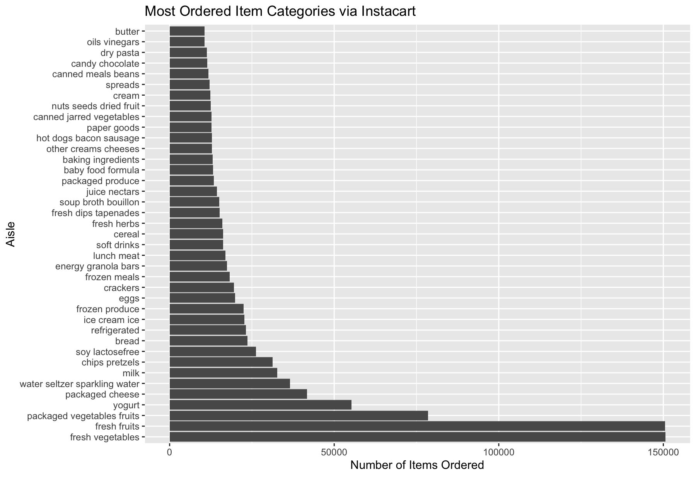
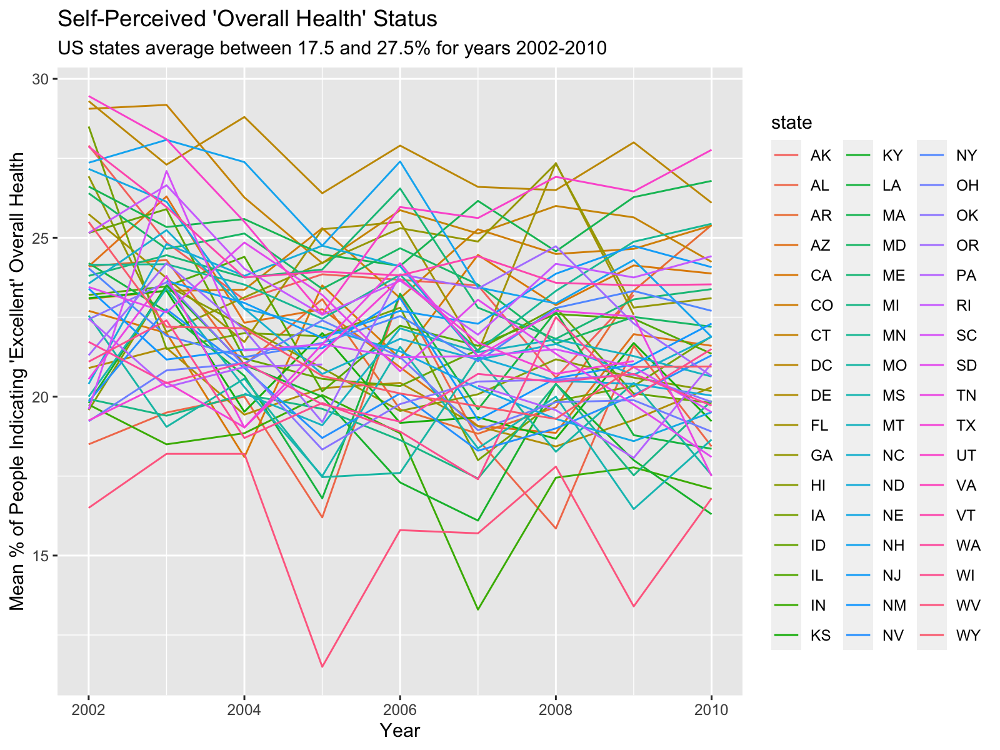
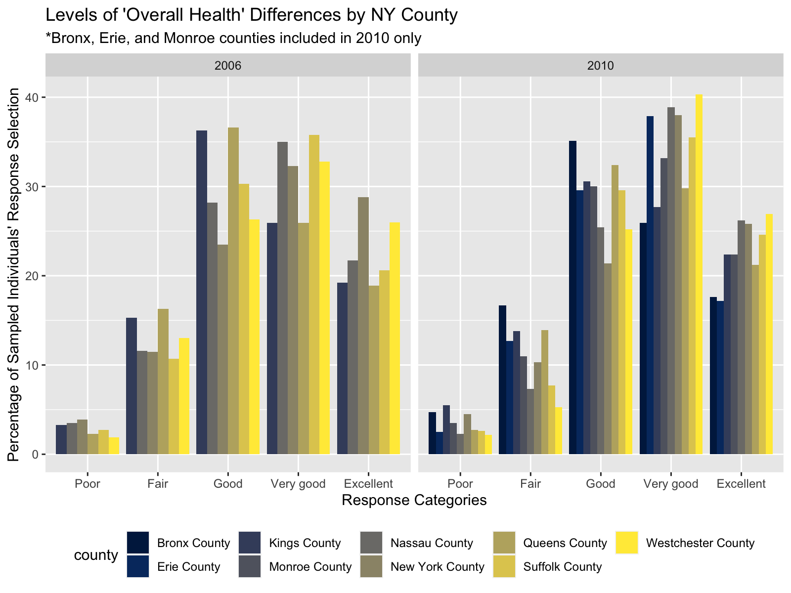
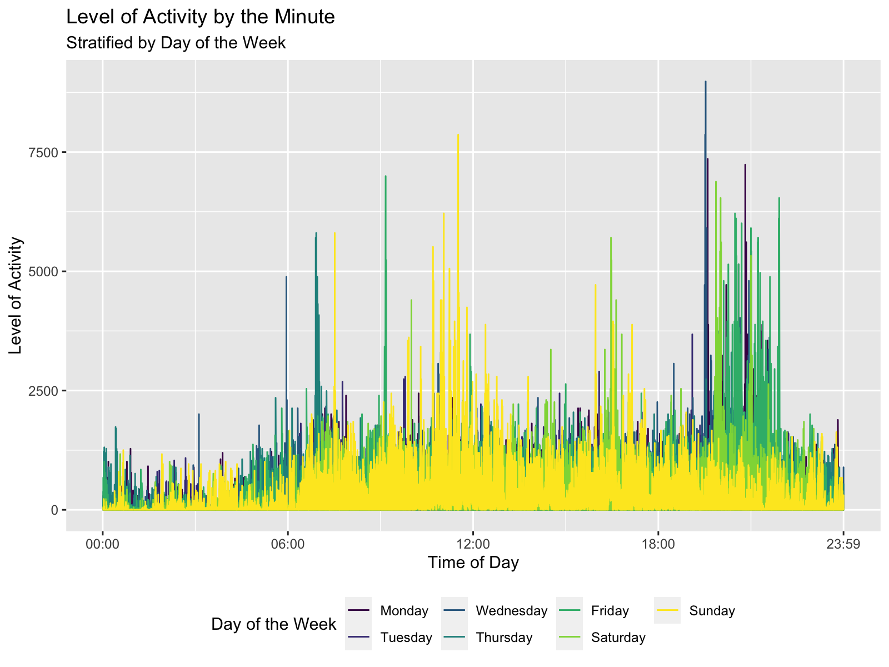

Data Science - Homework \#3
================
Jon Brock - JPB2210

  - [Problem \#1](#problem-1)
  - [Problem \#2](#problem-2)
  - [Problem \#3](#problem-3)
  - [Bonus Content](#bonus-content)

> *“Die Grenzen meiner Sprache bedeuten die Grenzen meiner Welt.” -
> Ludwig Wittgenstein, Tractatus Logico-Philosophicus*

``` r
library(tidyverse)
library(lubridate)
```

-----

## Problem \#1

###### (*25 points*)

##### *Exploration of the Instacart Data*

The following code imports the `instacart` dataset from the courses’
`p8105.datasets` github site. As we all know, Instacart is the online
service that allows consumers to order grocery items from a store of
their choosing, have someone pull the items from the shelf, bag them,
and either deliver them or set them aside for fast and easy pickup.

Given how massive the dataset is for this problem, we are going to pull
it from the `p8105.datasets` library and assign it as the `instacart`
tibble, as well as remove an unnecessary column `eval_set`.

*Note: Despite the instructions to load the `instacart` dataset via
`library(p8105.datasets)` I opted to use an equivalent method to which I
am partial. I hope this does not result in any lost points.*

``` r
instacart <- as_tibble(p8105.datasets::instacart) %>% 
    select(-eval_set)
```

-----

The dataset `instacart` has 14 variables. There are variables that are
specific to the items, such as `product_id`, `department`,
`product_name`, and `aisle`. There are also variables that are specific
to the consumer, such as `reordered`, `user_id`,
`days_since_prior_order`, and `order_dow`. This dataset has 131209
unique customers.

``` r
instacart %>% 
    group_by(aisle) %>% 
    summarise(aisle_count = n()) %>% 
    arrange(desc(aisle_count))
```

    ## # A tibble: 134 x 2
    ##    aisle                         aisle_count
    ##    <chr>                               <int>
    ##  1 fresh vegetables                   150609
    ##  2 fresh fruits                       150473
    ##  3 packaged vegetables fruits          78493
    ##  4 yogurt                              55240
    ##  5 packaged cheese                     41699
    ##  6 water seltzer sparkling water       36617
    ##  7 milk                                32644
    ##  8 chips pretzels                      31269
    ##  9 soy lactosefree                     26240
    ## 10 bread                               23635
    ## # … with 124 more rows

As we can see from our previous code chunk, there are 134 aisles. And
the top five aisles from which items are ordered are:

1.  fresh vegetables  
2.  fresh fruits  
3.  packaged vegetable fruits  
4.  yogurt  
5.  packaged cheese

-----

We can get a graphical representation of the top aisles ordered from
using the following code and interpreting the generated graphic.

``` r
instacart %>%
    group_by(aisle) %>% 
    summarize(aisle_count = n()) %>% 
    filter(aisle_count > 10000) %>%
    ggplot() +
        geom_col(aes(x = aisle_count, y = reorder(aisle, -aisle_count))) + 
        labs(
            title = "Most Ordered Item Categories via Instacart",
            x = "Number of Items Ordered",
            y = "Aisle")
```



-----

The following code chunk involves several steps, so I assigned it to its
own tibble (`insta_top_product_tbl`). We sought to find the most ordered
item from three specified aisles: `baking ingredients`, `dog food care`,
and `packaged vegetables fruits`. As such, this particular code chunk
merely prepares us for generating the required table.

``` r
insta_top_product_tbl <-
    instacart %>% 
    select(aisle, product_name) %>% 
    filter(aisle == c("baking ingredients", "dog food care", "packaged vegetables fruits")) %>% 
    group_by(aisle, product_name) %>% 
    mutate(product_count = n()) %>% 
    arrange(aisle, desc(product_count)) %>%
    distinct() %>% 
    group_by(aisle) %>% 
    filter(product_count == max(product_count))
```

Now that we’ve generated our tibble with our desired specifications, we
can write a short code to tidy up and neatly present our findings.

``` r
insta_top_product_tbl %>% 
    mutate(product_name = str_to_lower(product_name)) %>% 
    rename(
        "Aisle" = aisle,
        "Most Ordered Item" = product_name,
        "Number of Times Ordered" = product_count) %>% 
    knitr::kable()
```

| Aisle                      | Most Ordered Item                               | Number of Times Ordered |
| :------------------------- | :---------------------------------------------- | ----------------------: |
| baking ingredients         | light brown sugar                               |                     157 |
| dog food care              | organix grain free chicken & vegetable dog food |                      14 |
| packaged vegetables fruits | organic baby spinach                            |                    3324 |

-----

Next, we want to know what the mean hour time is for when customers
purchase either `Pink Lady Apples` or `Coffee Ice Cream` – yummy\!

``` r
instacart %>% 
    select(product_name, order_dow, order_hour_of_day) %>% 
    filter(product_name %in% c("Pink Lady Apples", "Coffee Ice Cream")) %>% 
    mutate(
        order_dow = order_dow + 1,
        dow = wday(order_dow, label = TRUE, abbr = FALSE)) %>% 
    group_by(product_name, dow) %>% 
    arrange(product_name, dow) %>% 
    select(product_name, dow, everything()) %>% 
    summarize(
        mean_hour = as.integer(mean(order_hour_of_day))) %>% 
    pivot_wider(
        names_from = "dow",
        values_from = "mean_hour") %>% 
    rename("Product" = product_name) %>% 
    knitr::kable(align = 'c')
```

|     Product      | Sunday | Monday | Tuesday | Wednesday | Thursday | Friday | Saturday |
| :--------------: | :----: | :----: | :-----: | :-------: | :------: | :----: | :------: |
| Coffee Ice Cream |   13   |   14   |   15    |    15     |    15    |   12   |    13    |
| Pink Lady Apples |   13   |   11   |   11    |    14     |    11    |   12   |    11    |

Our findings are presented in 24-hour time, which is a terribly
underutilized method of time keeping. There can never be any ambiguity\!
None of this, “I set my alarm for 7:00 p.m. instead of 7:00 a.m., and
that’s why I’m late for work” nonsense. 19:00 is 19:00. Bam\! Anyway, I
digress. Our data indicate that around the middle of the week customers
tend to order `Coffee Ice Cream` around 15:00, whereas `Pink Lady
Apples` are typically ordered around 11:00 during the week.

*Note: Unfortunately, I could not figure out how to display the times as
either `13:00` or `13:26`. I simply couldn’t devote any more time to
fixing this one minor issue.*

-----

## Problem \#2

###### (*25 points*)

##### *Exploration of the Behavioral Risk Factors Surveillance System Data*

The following code imports the `brfss` dataset from the courses’
`p8105.datasets` github site. We clean the column/variable names; filter
the dataset down to only the `"Overall Health"` topic; and coerce and
relevel the `response` (character) variable into a factor variable with
reordered factors going from `"Poor"` to "`Excellent"`.

**Dataset of how many people rated their “general health” as** `Poor`,
`Fair`, `Good`, `Very good`, **or** `Excellent` **within each county and
state.**

*Note: Again, I loaded the dataset `brfss_smart2010` using the same
process as I did in Problem \#1.*

``` r
brfss <- as_tibble(p8105.datasets::brfss_smart2010) %>% 
    janitor::clean_names() %>% 
    filter(topic == "Overall Health") %>% 
    mutate(
        response = fct_relevel(response, c("Poor", "Fair", "Good", "Very good", "Excellent")),
        county = str_to_lower(str_sub(locationdesc, 6, -1)),
        lat = str_sub(geo_location, 2, 10),
        lng = str_sub(geo_location, 13, 22)) %>% 
    rename(
        data_value_pct = data_value,
        state = locationabbr,
        cl_lower = confidence_limit_low,
        cl_upper = confidence_limit_high) %>% 
    select(year, state, county, response, sample_size, data_value_pct, respid, lat, lng)
```

Additionally, in terms of cleaning this dataset, there were far too many
unnecessary variables. What started as a running list of specific
variables to drop turned into a list of specific variables to keep. It
is also good practice to have simple and descriptive variable (and
sometimes observation) names (and values).

As such, I removed the leading state abbreviations from `locationdesc`
and renamed it accordingly. After running `count()` on several
variables, such as `class` (all observations = “Health Status”), `topic`
(all observations = “Overall Health”), and `question` (all observations
= “How is your general health?”), I saw no point in keeping columns with
no differing observations. Keep it tidy\!

(Bonus: though it wasn’t asked for, I split the `geo_location` variable
into its two requisite parts: `lat` and `lng`. Though, I do see that for
some observations, the last digit of the longitude value is truncated.
It maps the same location regardless.)

-----

The following code answers the question: “In **2002**, which states were
observed at 7 or more locations?”

``` r
brfss %>% 
    filter(year == "2002") %>% 
    group_by(state) %>%
    summarize(locations = n_distinct(county)) %>% 
    filter(locations >= 7)
```

    ## # A tibble: 6 x 2
    ##   state locations
    ##   <chr>     <int>
    ## 1 CT            7
    ## 2 FL            7
    ## 3 MA            8
    ## 4 NC            7
    ## 5 NJ            8
    ## 6 PA           10

The answer: `CT` (Connecticut), `FL` (Florida), `MA` (Massachusetts),
`NC` (North Carolina), `NJ` (New Jersey), and `PA` (Pennsylvania).

-----

The following code answers the question: “In **2010**, which states were
observed at 7 or more locations?”

``` r
brfss %>% 
    filter(year == "2010") %>% 
    group_by(state) %>%
    summarize(locations = n_distinct(county)) %>% 
    filter(locations >= 7)
```

    ## # A tibble: 14 x 2
    ##    state locations
    ##    <chr>     <int>
    ##  1 CA           12
    ##  2 CO            7
    ##  3 FL           41
    ##  4 MA            9
    ##  5 MD           12
    ##  6 NC           12
    ##  7 NE           10
    ##  8 NJ           19
    ##  9 NY            9
    ## 10 OH            8
    ## 11 PA            7
    ## 12 SC            7
    ## 13 TX           16
    ## 14 WA           10

The answer: `CA` (California), `CO` (Colorado), `FL` (Florida), `MA`
(Massachusetts), `MD` (Maryland), `NC` (North Carolina), `NE`
(Nebraska), `NJ` (New Jersey), `NY` (New York), `OH` (Ohio), `PA`
(Pennsylvania), `SC` (South Carolina), `TX` (Texas), and `WA`
(Washington – **my home state\!**).

-----

The following code generates a plot that shows the time trends of the
percent of people within each state responding with `Excellent` when
asked how they perceive their overall health.

``` r
brfss %>% 
    filter(response == "Excellent") %>% 
    group_by(year, state) %>% 
    summarize(
        mean_pct = mean(data_value_pct)) %>% 
    ggplot(
        aes(x = year, y = mean_pct, group = state, colour = state)) +
        geom_line() +
        labs(
            title = "Self-Perceived 'Overall Health' Status",
            subtitle = "US states average between 17.5 and 27.5% for years 2002-2010",
            x = "Year",
            y = "Mean % of People Indicating 'Excellent' Overall Health")
```



As we can see from the generated graphic, the mean percentage of people
indicating `Excellent` overall health across all US states falls between
\~12% at the lowest point and \~29% at the highest. However, there is a
high density of mean percentages that fall between 17.5% and 27.5%. Come
on, America, we can do better\!

-----

The following code generates comparative plots (by years `2006` and
`2010`) for the five responses (`Poor` to `Excellent`) distribution
among locations in NY State.

``` r
brfss %>% 
    mutate(county = str_to_title(county)) %>% 
    filter(
        year %in% c(2006, 2010),
        state == "NY") %>% 
        group_by(year, county) %>%
    ggplot(aes(x = response, y = data_value_pct, fill = county)) + 
    geom_col(position = "dodge") + 
    facet_grid(. ~ year) +
    viridis::scale_fill_viridis(
        option = "cividis",
        name = "county",
        discrete = TRUE) +
    labs(
        title = "Levels of 'Overall Health' Differences by NY County",
        subtitle = "*Bronx, Erie, and Monroe counties included in 2010 only",
        x = "Response Categories",
        y = "Percentage of Sampled Individuals' Response Selection") +
    theme(legend.position = "bottom")
```



It’s important for us to note that Bronx, Erie, and Monroe counties were
not included in the 2006 data. However, we see from 2006 to 2010, the
rates of individuals indicating that they had `Very good` overall health
rose significantly for all counties included in both years. This is
especially evident for Westchester and Nassau counties.

-----

## Problem \#3

###### (*25 points*)

##### *Exploration of Accelerometer Data from a 63 Year-Old Male with BMI 25*

The following problem deals with the tidying and wrangling of an
extremely **wide** dataset. First, we will import the `accel_data.csv`
file from our `data` subfolder.

``` r
accel_data <- read_csv("./data/accel_data.csv")
```

-----

Now that we’ve imported the dataset, we can see that there are 1443
variables and only 35 rows. But this is just poor data management. So,
let’s get this tidy\!

The following code chunk drastically tidys and wrangles our
accelerometer data into a neat dataset.

``` r
tidy_accel <-
    accel_data %>% 
    pivot_longer(
        activity.1:activity.1440,
        names_to = "activity",
        values_to = "activity_count") %>% 
    mutate(
        day_type = case_when(
            day %in% c("Saturday", "Sunday") ~ "weekend",
            TRUE ~ "weekday"),
        day = fct_relevel(day, c("Monday", "Tuesday", "Wednesday", "Thursday", "Friday", "Saturday", "Sunday")))

tidy_accel
```

    ## # A tibble: 50,400 x 6
    ##     week day_id day    activity    activity_count day_type
    ##    <dbl>  <dbl> <fct>  <chr>                <dbl> <chr>   
    ##  1     1      1 Friday activity.1            88.4 weekday 
    ##  2     1      1 Friday activity.2            82.2 weekday 
    ##  3     1      1 Friday activity.3            64.4 weekday 
    ##  4     1      1 Friday activity.4            70.0 weekday 
    ##  5     1      1 Friday activity.5            75.0 weekday 
    ##  6     1      1 Friday activity.6            66.3 weekday 
    ##  7     1      1 Friday activity.7            53.8 weekday 
    ##  8     1      1 Friday activity.8            47.8 weekday 
    ##  9     1      1 Friday activity.9            55.5 weekday 
    ## 10     1      1 Friday activity.10           43.0 weekday 
    ## # … with 50,390 more rows

That’s better\! We made the following changes to our raw data:

1.  We created a new variable `day_type` that indicates whether the
    observation falls on a `weekday` or `weekend`.  
2.  We converted our `day` character variable to a factor variable with
    ordered levels (M/T/W/Th/F).  
3.  We pivoted the dataset to be longer; this resulted in a dataset with
    6 variables and 50400 rows.

-----

Using our tidy dataset (`tidy_accel`) we can generate a neat table for
scrutiny. What we see is the total measured amount of **activity
counts** by the 63 year-old male in question stratified by both week
number and the day of each week.

``` r
tidy_accel %>% 
    group_by(week, day) %>% 
    summarize(day_total = sum(activity_count)) %>% 
    mutate(day_total = round(day_total, digits = 0)) %>% 
    pivot_wider(
        names_from = day,
        values_from = day_total) %>% 
    rename("Week" = week) %>% 
    knitr::kable(align = 'c')
```

| Week | Monday | Tuesday | Wednesday | Thursday | Friday | Saturday | Sunday |
| :--: | :----: | :-----: | :-------: | :------: | :----: | :------: | :----: |
|  1   | 78828  | 307094  |  340115   |  355924  | 480543 |  376254  | 631105 |
|  2   | 295431 | 423245  |  440962   |  474048  | 568839 |  607175  | 422018 |
|  3   | 685910 | 381507  |  468869   |  371230  | 467420 |  382928  | 467052 |
|  4   | 409450 | 319568  |  434460   |  340291  | 154049 |   1440   | 260617 |
|  5   | 389080 | 367824  |  445366   |  549658  | 620860 |   1440   | 138421 |

We observe some minor trends with the table results. For instance, the
last two weekends of the five week observation period showed much lower
activity counts than in previous weeks and weekends. Furthermore, the
middle days of the week (`Tuesday`, `Wednesday`, and `Thursday`) on
average showed less activity counts than other days of the week. This is
especially true in Weeks `1` and `3`.

-----

Next, let’s graph a time plot of all the activity metrics across each
day of the week by the minute.

``` r
tidy_accel %>% 
    mutate(min_of_day = as.integer(str_sub(activity, 10, -1))) %>% 
    ggplot(aes(x = min_of_day, y = activity_count, color = day)) +
    geom_line() +
    scale_x_continuous(
        breaks = c(0, 360, 720, 1080, 1440),
        labels = c("00:00", "06:00", "12:00", "18:00", "23:59")) +
    labs(
        title = "Level of Activity by the Minute",
        subtitle = "Stratified by Day of the Week",
        x = "Time of Day",
        y = "Level of Activity") +
    viridis::scale_color_viridis(
        name = "Day of the Week", 
        discrete = TRUE) +
    theme(legend.position = "bottom")
```



We can see from this terribly busy graphic that our patient had
increased activity on Sunday around 11:00, and on Friday and Saturday in
the later hours of \~ 20:00 to 22:00. So, we may conclude that this
individual likes to get his early-evening party on during the weekend,
and then go work off all the beer on Sunday at the gym. But, that’s just
my own theory based on this data.

-----

## Bonus Content

> “Oh, so you think darkness is your ally? But you merely adopted the
> dark. I was born in it, molded by it.” -[Bane
> Cat.](https://youtu.be/5ywjpbThDpE)

<center>


</center>
