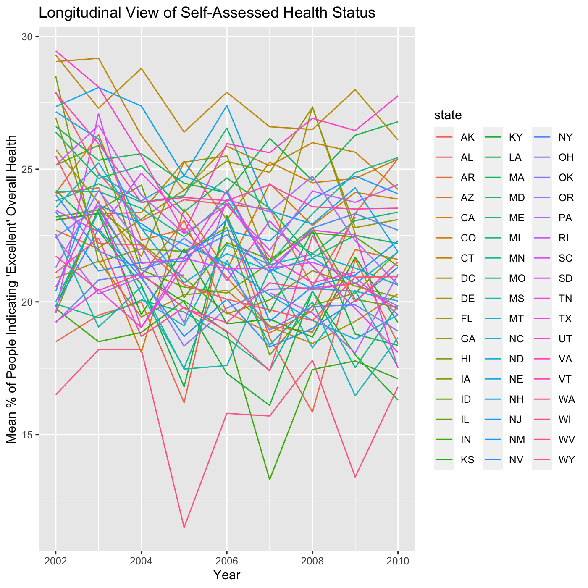

Data Science - Homework \#3
================
Jon Brock - JPB2210

  - [Problem \#1](#problem-1)
  - [Problem \#2](#problem-2)
  - [Problem \#3](#problem-3)
  - [Bonus Content](#bonus-content)

> *“Die Grenzen meiner Sprache bedeuten die Grenzen meiner Welt.”" -
> Ludwig Wittgenstein, Tractatus Logico-Philosophicus*

``` r
library(tidyverse)
```

-----

## Problem \#1

###### (*25 points*)

##### *Exploration of the Instacart Data*

The following code imports the `instacart` dataset from the courses’
`p8105.datasets` github site. As we all know, Instacart is the online
service that allows consumers to order grocery items from a store of
their choosing, have someone pull the items from the shelf, bag them,
and either deliver them or set them aside for fast and easy pickup.

Given how massive the dataset is for this problem, we are going to pull
it from the `p8105.datasets` library and assign it as the `instacart`
tibble, as well as remove an unnecessary column `eval_set`.

``` r
#CODE CHUNK COMPLETED
instacart <- as_tibble(p8105.datasets::instacart) %>% 
    select(-eval_set)
```

The dataset `instacart` has 14 variables. There are variables that are
specific to the items, such as `product_id`, `department`,
`product_name`, and `aisle`. There are also variables that are specific
to the consumer, such as `reordered`, `user_id`,
`days_since_prior_order`, and `order_dow`. This dataset has 131209
unique customers.

``` r
#CODE CHUNK COMPLETED
instacart %>% 
    group_by(aisle) %>% 
    summarise(aisle_count = n()) %>% 
    arrange(desc(aisle_count))
```

    ## # A tibble: 134 x 2
    ##    aisle                         aisle_count
    ##    <chr>                               <int>
    ##  1 fresh vegetables                   150609
    ##  2 fresh fruits                       150473
    ##  3 packaged vegetables fruits          78493
    ##  4 yogurt                              55240
    ##  5 packaged cheese                     41699
    ##  6 water seltzer sparkling water       36617
    ##  7 milk                                32644
    ##  8 chips pretzels                      31269
    ##  9 soy lactosefree                     26240
    ## 10 bread                               23635
    ## # … with 124 more rows

As we can see from our previous code chunk, there are 134 aisles. And
the top five aisles from which items are ordered are:

1.  fresh vegetables  
2.  fresh fruits  
3.  packaged vegetable fruits  
4.  yogurt  
5.  packaged cheese

<!-- end list -->

``` r
#CODE CHUNK COMPLETED
instacart %>%
    group_by(aisle) %>% 
    summarize(aisle_count = n()) %>% 
    filter(aisle_count > 10000) %>%
    ggplot() +
        geom_col(aes(x = aisle_count, y = reorder(aisle, -aisle_count))) + 
        labs(
            title = "Most Ordered Item Categories via Instacart",
            x = "Number of Items Ordered",
            y = "Aisle")
```


``` r
#WORKING CODE = NOT COMPLETED
instacart %>% 
    filter(aisle == c("baking ingredients", "dog food care", "packaged vegetables fruits")) %>% 
    group_by(aisle, product_name) %>% 
    select(aisle, product_name, everything()) %>% 
    count(product_name)

    summarize(product_name = n()) %>% 
    
    group_by(product_name, aisle_count) %>% 
    summarize(product_name) %>% 
    pivot_wider(
        names_from = "aisle",
        values_from = "aisle_count") %>% 
    knitr::kable(align = 'c')
```

``` r
instacart %>% 
    group_by(user_id, order_id) %>% 
    select(order_id, user_id, everything())
```

-----

## Problem \#2

###### (*25 points*)

##### *Exploration of the Behavioral Risk Factors Surveillance System Data*

The following code imports the `brfss` dataset from the courses’
`p8105.datasets` github site. We clean the column/variable names; filter
the dataset down to only the `"Overall Health"` topic; and coerce and
relevel the `response` (character) variable into a factor variable with
reordered factors going from `"Poor"` to "`Excellent"`.

**Dataset of how many people rated their “general health” as** `Poor`,
`Fair`, `Good`, `Very good`, **or** `Excellent` **within each county and
state.**

``` r
#CODE CHUNK COMPLETED
brfss <- as_tibble(p8105.datasets::brfss_smart2010) %>% 
    janitor::clean_names() %>% 
    filter(topic == "Overall Health") %>% 
    mutate(
        response = fct_relevel(response, c("Poor", "Fair", "Good", "Very good", "Excellent")),
        county = str_to_lower(str_sub(locationdesc, 6, -1)),
        lat = str_sub(geo_location, 2, 10),
        lng = str_sub(geo_location, 13, 22)) %>% 
    rename(
        data_value_pct = data_value,
        state = locationabbr,
        cl_lower = confidence_limit_low,
        cl_upper = confidence_limit_high) %>% 
    select(year, state, county, response, sample_size, data_value_pct, respid, lat, lng)
```

Additionally, in terms of cleaning this dataset, there were far too many
unnecessary variables. What started as a running list of specific
variables to drop turned into a list of specific variables to keep. It
is also good practice to have simple and descriptive variable (and
sometimes observation) names (and values).

As such, I removed the leading state abbreviations from `locationdesc`
and renamed it accordingly. After running `count()` on several
variables, such as `class` (all observations = “Health Status”), `topic`
(all observations = “Overall Health”), and `question` (all observations
= “How is your general health?”), I saw no point in keeping columns with
no differing observations. Keep it tidy\!

(Bonus: though it wasn’t asked for, I split the `geo_location` variable
into its two requisite parts: `lat` and `lng`. Though, I do see that for
some observations, the last digit of the longitude value is truncated.
It maps the same location regardless.)

``` r
#CODE CHUNK COMPLETED
brfss %>% 
    filter(response == "Excellent") %>% 
    group_by(year, state) %>% 
    summarize(
        mean_pct = mean(data_value_pct)) %>% 
    ggplot(
        aes(x = year, y = mean_pct, group = state, colour = state)) +
        geom_line() +
        labs(
            title = "Longitudinal View of Self-Assessed Health Status",
            x = "Year",
            y = "Mean % of People Indicating 'Excellent' Overall Health")
```



-----

## Problem \#3

###### (*25 points*)

##### *Exploration of Accelerometer Data from a 63 Year-Old Male with BMI 25*

``` r
accel_data <- read_csv("./data/accel_data.csv")
```

-----

## Bonus Content

> “Oh, so you think darkness is your ally? But you merely adopted the
> dark. I was born in it, molded by it.” -[Bane
> Cat.](https://youtu.be/5ywjpbThDpE)

<center>


</center>
